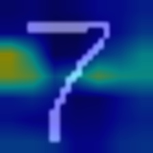
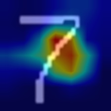

# SA-MobileNetV3
Shuffle Attention for MobileNetV3


## Reference
- SA-NET: Shuffle Attention for deep convolutional neural networks: https://github.com/wofmanaf/SA-Net

## Experiments

#### on ImageNet

Attempt | Parameters | Madds | Top1-acc | Sample visualization |
--- | --- | --- | --- | --- |
MobileNetV3-Large | 5.4 M | 448.69 M | 75.2%  | 
SA-MobileNetV3-Large | **3.9 M** | **445.68 M** | **76.8%** |

#### on CIFAR-10

Attempt | Parameters | Madds | Top1-acc | Sample visualization |
--- | --- | --- | --- | --- |
MobileNetV3-Large| 4.2 M | 446.16 M |  |
SA-MobileNetV3-Large | **2.7 M** | **443.14 M** |  |

#### on MNist

Attempt | Parameters | Madds | Top1-acc | Sample visualization | Sample visualization |
--- | --- | --- | --- | --- | --- |
MobileNetV3-Large | 4.2 M | 446.16 M | 0.997% |  |  ||
SA-MobileNetV3-Large | **2.7 M** | **443.14 M** | **0.998%** | |  ||

## Train

Run the following command for train model on your own dataset:
```
python train.py --dataset mnist 
```

## Test

Run the following command for evaluation trained model on test dataset:
```
python test.py --dataset mnist
```

## Inference

Run the following command for classification images:
```
python inference.py --input /path/to/image.jpg 
```


## Citation
Please cite our paper if you find this repo useful in your research.
```
@article{
}
```