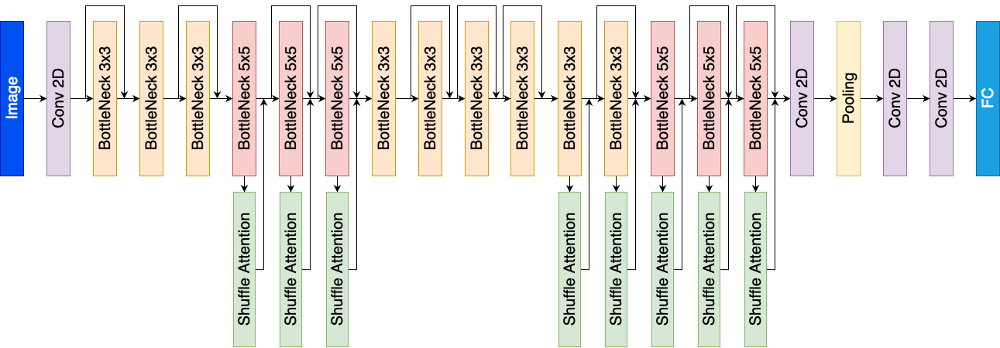

# SA-MobileNetV3
Shuffle Attention for MobileNetV3




## Train

Run the following command for train model on your own dataset:
```
python train.py --dataset mnist 
```

## Train

Run the following command for evaluation trained model on test dataset:
```
python test.py --dataset mnist
```

## Inference

Run the following command for classification images:
```
python inference.py --input /path/to/image.jpg 
```

